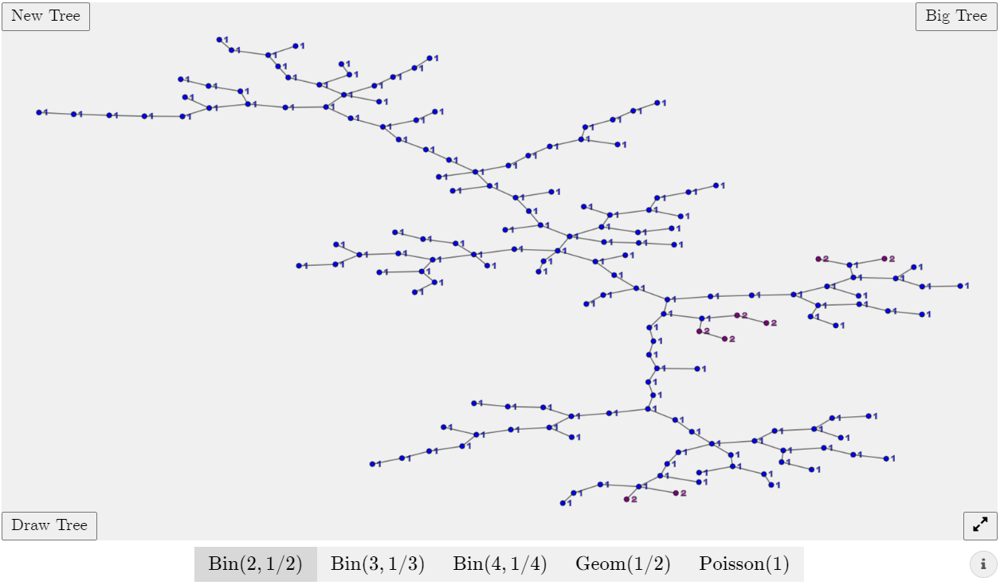

# Random Trees
Generate random critical Galton-Watson trees and display their free trees in a force-directed layout. [Visit the page](https://abrandenberger.github.io/random-trees/)!

Displaying the free trees: 
- The free tree structure is animated via a hand-coded model with spring and repulsive forces. 
- Displayed beside each node is its *multiplicity*, i.e., the number of nodes in the free tree that look identical to it. *The notion is more formally defined in the text.* 

Tree generation: 
- The user has a choice of *offspring distribution* between various binomial distributions, the geometric distribution and the Poisson distribution. 
- `New Tree` generates a Galton-Watson tree with the selected offspring distribution (with limited size to avoid computational and visual overload) 
- `Big Tree` also generates such a tree, but conditioned to have large size! 
- You can draw your own tree using `Draw Tree`; the multiplicities of each node will be shown and updated as the tree is drawn. It will be animated once `Done` is clicked. 
